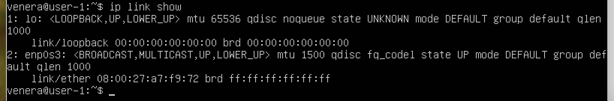
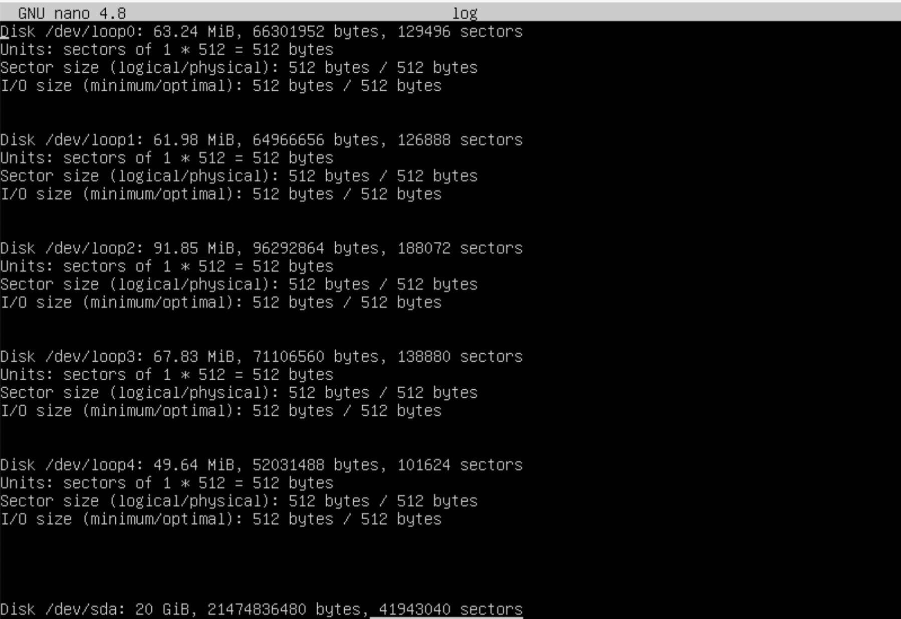

## Part 1. Установка ОС
- скачиваем и устанавливаем Ubuntu 20.04 Server LTS без графического интерфейса.
- версия Ubuntu\

## Part 2. Создание пользователя
- создание пользователя командой `sudo adduser user name` и добавление пользователя в adm командой `sudo usermod -a - G adm annabelw`\

- вывод команды `cat /etc/passwd`\

## Part 3. Настройка сети ОС
- ввела команду `sudo nano /etc/hostname` для редактирования файла  
- отредактировала файл `/etc/hosts` командой sudo nano `/etc/hosts`
, перезагрузила систему для применения изменений\

- Перед сменой часового пояса нужно узнать длинное имя часового пояса, которое нужно использовать командой `timedatectl list-timezones`
- Установка временной зоны(Мск) командой `sudo timedatectl set-timezone your_time_zone`\

- команда для вывода названия сетевых интерфейсов `ip link show`\
 
- lo (loopback device) – виртуальный интерфейс, присутствующий по умолчанию в любом Linux. Он используется для отладки сетевых программ и запуска серверных приложений на локальной машине. С этим интерфейсом всегда связан адрес 127.0.0.1. У него есть dns-имя – localhost.
- ip-адрес устройства\

- DHCP (англ. Dynamic Host Configuration Protocol — протокол динамической настройки узла) —
  прикладной протокол, позволяющий сетевым устройствам автоматически получать IP-адрес и другие параметры,
  необходимые для работы в сети TCP/IP. Данный протокол работает по модели «клиент-сервер».
  Для автоматической конфигурации компьютер-клиент на этапе конфигурации сетевого устройства обращается
  к так называемому серверу DHCP и получает от него нужные параметры.

- Что бы отобразить внешний ip-адрес шлюза использутся команда `wget -O - -q icanhazip.com`\

- Что бы отобразить внутрений ip-адрес шлюза можно использовать команду `ip route | grep default` \

- Что бы задать (заданные вручную, а не полученные от DHCP сервера) настройки ip, gw, dns (использовать публичный DNS серверы, например 1.1.1.1 или 8.8.8.8) открываем файл по команде `sudo nano /etc/netplan/*.yaml` и изменяем настройки:\

- Убедилась, что статичные сетевые настройки (ip, gw, dns) соответствуют заданным в предыдущем пункте.\

- Пропингуем удаленные хосты:\

## Part 4. Обновление ОС
- Обновить системные пакеты до последней можно применив команды:
`sudo apt-get update`
`sudo apt-get upgrade`
- сообщение, что обновления отсутствуют\
 

## Part 5. Использование команды sudo
- Команда sudo ( substitute user and do, подменить пользователя и выполнить ) позволяет строго определенным пользователям выполнять указанные программы с административными привилегиями без ввода пароля суперпользователя root.
- разрешила пользователю выполнять команду sudo\ командой `sudo usermod -aG sudo <user name>`
\

- команда для смены hostname через sudo: `sudo hostnamectl set-hostname annabelw`
\

- измененный hostname \

## Part 6. Установка и настройка службы времени
- Проверяем время командой `timedatectl`:\

- вывод команды NTPSynchronized=yes: 
timedatectl show \
 

## Part 7. Установка и использование текстовых редакторов
-  Для установки текстового редактора используется команда `sudo apt install <name of the text editor>` 
- VIM\
\
выход с сохранением -`Esc`, `:wq`, после чего нажимаем `Enter`.
- NANO\
\
выход с сохранением - `cntrl+x`, `Y`, после чего нажимаем `Enter;
- JOE\
\
 выход с сохранением - `cntrl+x+k`;
- VIM \
\
выход без сохранения- `esc`, `:q!`;
- NANO \
\
выход без сохранения - `cntrl+x`, `N`;
- JOE \
\
 выход без сохранения - `cntrl+q+k`, `n`;
- VIM \
\
 поиск слова - команда:/слово
- NANO\
\
 поиск слова:`Ctrl + w`
- JOE \
\
 поиск слова:`Ctrl + k + f`
- VIM \
\
 замена слова: `:s/.../.../`
- NANO\
\
 для замены элемента используют сочетание клавишь `Ctrl + W` и `Ctrl + R`, после чего вводится то, что заменяется, после нажатие на `Enter` водится вводится новая строка, подвержаетя `Enter` и соглашается клавишей `Y`
- JOE\
\
замена слова:`Ctrl + k + f`, `R`

## Part 8. Установка и базовая настройка сервиса SSHD
- Установила SSH с помощью команды: `sudo apt-get install ssh`
- Установила OpenSSH: `sudo apt install openssh-server`
- Добавила пакет SSH-сервера в автозагрузку: `sudo systemctl enable sshd`
- Меняем порт в конфигурационном файле SSH сервера:`sudo nano /etc/ssh/sshd_config`
- Port 22->Port 2022\

- Используя команду ps, показать наличие процесса sshd. Для этого к команде нужно подобрать ключи\
 Команда ps выводит список текущих процессов на сервере. Опция C фильтрует процессы по указанной строке.
- Вывод команды netstat -tan \

- Значение ключей -tan:\
    -t - Отображение текущего подключения в состоянии переноса нагрузки с процессора на сетевой адаптер при передаче данных ( "offload" ).\
    -a - Отображение всех подключений и ожидающих портов.\
    -n - Отображение адресов и номеров портов в числовом формате.
  - Значение каждого столбца вывода:
    - Proto - название протокола
    - Recv-Q - cчётчик байт не скопированных программой пользователя из - этого сокета
    - Send-Q - счётчик байтов, не подтверждённых удалённым узлом
    - Local Address - адрес и номер порта локального конца сокета
    - Foreign Address - адрес и номер порта удалённого конца сокета
    - Status - состояние соединение\
    Виды соединений:
    - ESTABLISHED - соединение установлено
    - SYN_SENT - сокет пытается установить соединение
    - SYN_RECV - начальная синхронизация соединения
    - FIN_WAIT1 - сокет закрыт, ожидание отключения соединения
    - FIN_WAIT2 - ожидание отключения удаленной стороны
    - TIME_WAIT - ожидание после закрытия повторной передачи отключения удаленной стороны
    - CLOSED - соединение закрыто, сокет не используется
    - CLOSE_WAIT - удаленный узел отключился, сокет скоро будет закрыт
    - LAST_ACK - сначала отключилась удаленная сторона, а затем сокет будет закрыт
    - LISTEN - сокет ожидает входящих соединений
    - CLOSING - закрытие сокета, точнее сокет закрыт, а затем отключился удаленный узел
    - UNKNOWN - состояние сокета неизвестно.
  - Значение 0.0.0.0 означает - "любой адрес"

## Part 9. Установка и использование утилит top, htop
- top
- команда `sudo apt install top` для установки утилиты top
- запуск top командой `top`\

- uptime : 56 min
- количество авторизованных пользователей: 1
- общее количество процессов: 94
- загрузка cpu: 0
- загрузка памяти: 976,9
- pid процесса занимающего больше всего памяти: 1
- pid процесса, занимающего больше всего процессорного времени: 1
- htop
- команда `sudo apt-get install htop` для установки утилиты htop
- Отсортированный по PID\
    
- Отсортированный по PERCENT_CPU\
    
- Отсортированный по PERCENT_MEM\
    
- Отсортированный по TIME\
    
- Отфильтрованному для процесса sshd\
    
- С процессом syslog, найденным, используя поиск\
    
- С добавленным выводом hostname, clock и uptime\
    

## Part 10. Использование утилиты fdisk
- результат команды `sudo fdisk -l` \

- название жесткого диска:/dev/sda
- размер - 20 GiB
- количество секторов - 41943040
- \
 размер swap - 1.9G

## Part 11. Использование утилиты df
- вывод команды `df` \

- вывод команды df для корневого раздела размер корневого раздела:9.8G; размер занятого пространства:5.2G; размер свободного пространства:4.1G; процент использования: 56%. 
- The 1K block in GNU coreutils df(1) means 1024 bytes
- вывод команды `df -Th`\
размер раздела:9.8G; размер занятого пространства:5.2G; размер свободного пространства:4.1G; процент использования: 56%. Тип файловой системы: ext4.

## Part 12. Использование утилиты du
- размер /home \

- размер  /var\

- размер /var/log \

- вывод команды `sudo du -sh /var/log/*`\

## Part 13. Установка и использование утилиты ncdu
- установила утилиту ncdu командой `sudo apt-get install ncdu`
- размер /home \

- размер /var \

- размер /var/log \

## Part 14. Работа с системными журналами
- вывод команды `sudo utmpdump /var/log/dmesg`\

- вывод команды `sudo utmpdump /var/log/syslog` \

- вывод команды `sudo utmpdump /var/log/auth.log`\

- последняя успешная авторизация командой last\

- Перезагрузила службу SSHd командой `sudo systemctl restart ssh`
- сообщение и рестарте службы\

## Part 15. Использование планировщика заданий CRON
- открыла файл для редактирования командой `sudo crontab -e`
- добавила команду\

- в системных журналах строчки о выполнении\

- список текущих заданий для CRON\

- Удаление всех заданий и з планировщика заданий выполняется командой crontab -r
Список текущих заданий после удаления:\
